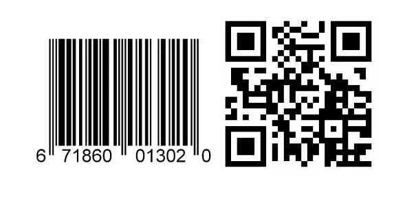

# Motivation

Barcodes sind vielfältig einsetzbar. In der Produktion erlauben Barcodes eine Steuerung, Überwachung, Verfolgung, Automatisierung, Vereinfachung und Optimierung in Unternehmensabläufen. Über Barcodes werden Prozessinformationen gesammelt und im IT-System erfasst. Das System stellt dann die entschlüsselten Informationen bereit.

Fakt ist, dass Barcodes eine bessere Steuerung von Unternehmensabläufen ermöglichen. Einzelne Abläufe lassen sich leichter überwachen und können bei Bedarf optimiert werden. Das bietet sich auch dann an, wenn bestimmte Abläufe automatisiert werden sollen. In der Industrie sind Barcodes ohnehin unerlässlich. Schließlich sind diese wichtig, um Prozessinformationen zu sammeln.

In diesem Projekt wird eine Smartphone-App entwickelt. Die App widerspiegelt die Funktionalität eines IT-Systems. Die Barcodes werden über die Kamera des Smartphones gescannt. Die dekodierte Information wird dem Benutzer auf dem Bildschirm bereitgestellt.