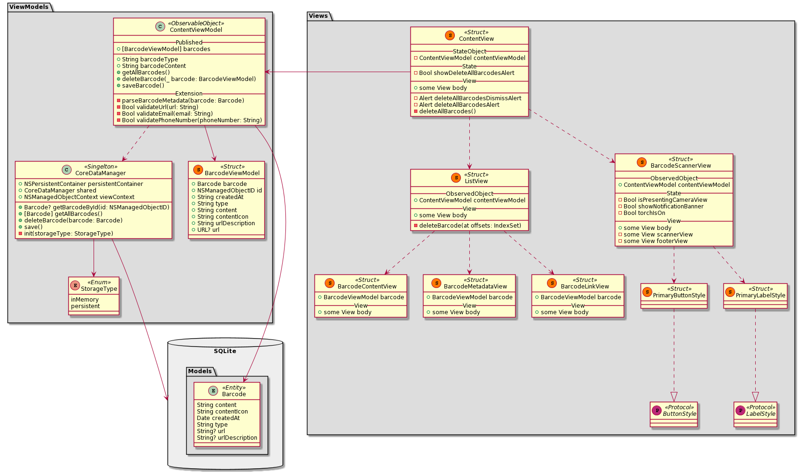

# Implementation

Project environment setup is an essential part of the development process. The Xcode IDE offers good functionality, GitHub integration and code management tools.

According to the MVVM pattern the architecture of the application was implemented using three packages namely `Views`, `ViewModels`, `Models`.

The views in the package `Views` represent the UI. It is a container used only to display the data. The main view `Views.ContentView` observes the `ViewModels.ContentViewModel`, which is an `ObservableObject`. The changes in the **published** data of the `ObservableObject` are immediately trigger an update in the `Views` package.

The barcode scanner uses the camera view to capture and scan the barcodes. It is implemented in the `Views.BarcodeScannerView` and serves the incoming barcode information for the `ObservableObject`.

`ViewModels` package keeps track of its state. It cares about how the data is created, updated and deleted. The `ObservableObject` uses a static `ViewModels.CoreDataManager` object. The object sends requests to access the data from a SQLite database. The database has only one data model for the entity `Barcode`.

The application works in horizontal and vertical orientation. The dark theme is optional, it can be changed in user settings. The app should work on all iOS devices with the newest iOS (v14+).
