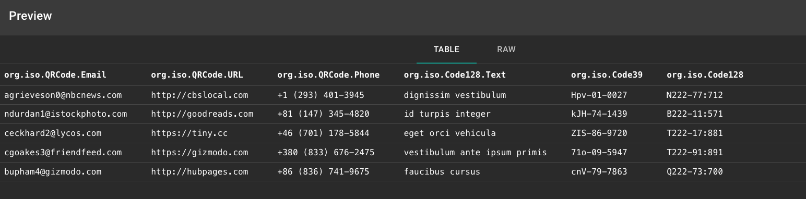
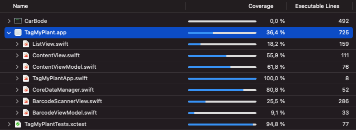

# Verification

The verification process aims to check the code with the intent of finding failures. To make the application perform well, it should not contain critical errors and bugs. 

The mock data can be generated using Mockaroo service. That data is used to simulate the barcode information. Test setup gets the data via HTTP `GET` request from the Mockaroo server.

The object of the tests is the `ViewModels` package, with the focus on the `ViewModels.ContenViewModel` object. The test process ensures that the data manipulation performs save, without any errors.

The detailed code coverage report is shown below.

