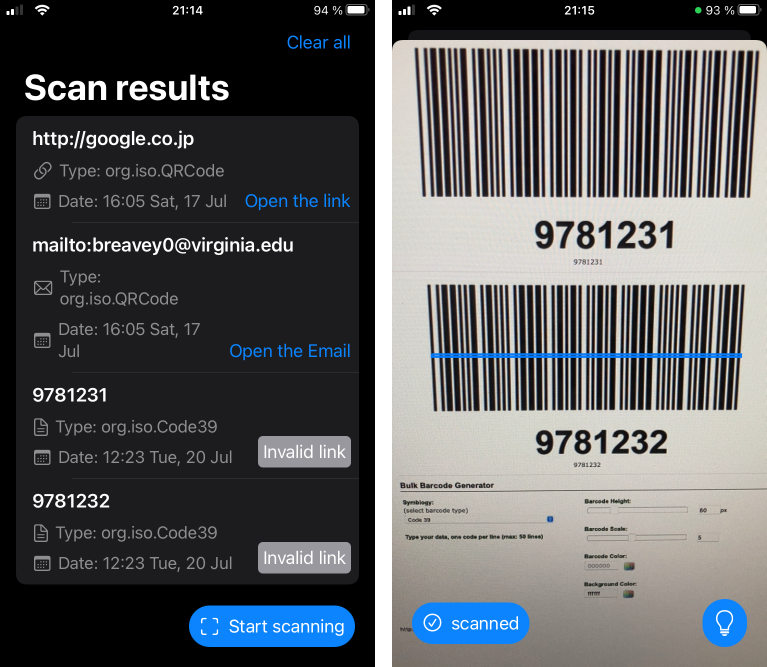

# Validation

The target device iPhone SE2 is used to validate the functionality of the application in the production environment. In a wireless mode, the smartphone can send debug information to the IDE console. This information can be used to identify bugs and errors.

Using the online barcode generator tool, different barcode types can be generated and used by the validation process. Using the smartphone, the UI functionality can be also easily validated.

The following images represent the application in production environment.

## UPD: Supported Machine-Readable Object Types

Different [Machine-Readable ObjectTypes](https://developer.apple.com/documentation/avfoundation/avmetadatamachinereadablecodeobject/machine-readable_object_types) can be supported by the application. In the particular implementation the types `qr`, `code39` and `code128` were used for the verification and validation purpose.