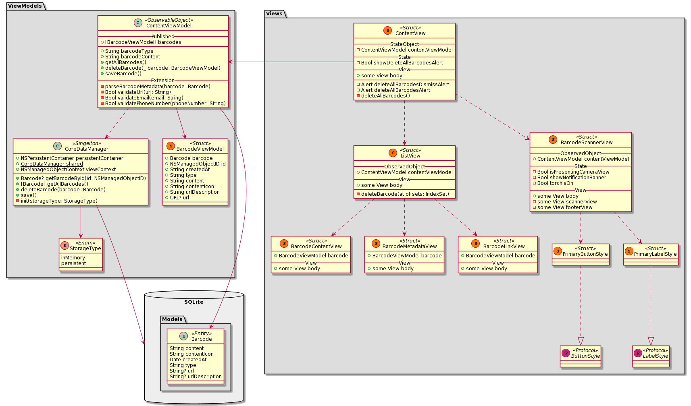
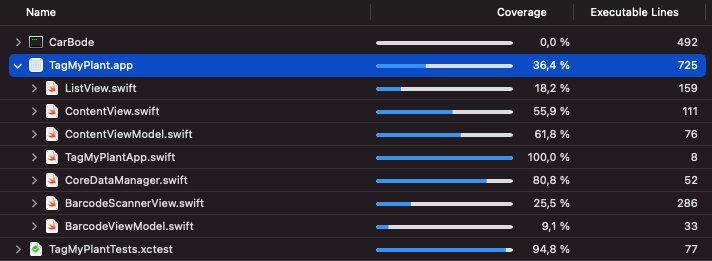

# Motivation

Today we can see barcodes on nearly every product. They represent a
piece of information. This information is machine-readable. It is mostly
used to identify a product.

The barcodes can be scanned with traditional laser scanners, or using
camera-based imaging scanners \[1\]. Professional scanning systems are
used in industries with a large amount of product tracking information.
They serve this information to IT-Systems, which can proceed the data
and automate the production processes.

In this project was implemented a system to scan and represent the
barcode information using only a smartphone. The motivation was to
simulate a production process. The system should be able to scan
barcodes continuously and make the barcode information accessible for
the user.

# Tools

There is a wide variety of tools on the market can be used to develop a mobile application. The list below was based on a personal preference and tools I have experience with.

## Concept

| Tool                                                                                               | Description                           |
| :------------------------------------------------------------------------------------------------- | :------------------------------------ |
| [Concepts](https://concepts.app/en/)                                                               | Sketching and drawing                 |
| [Figma](https://www.figma.com)                                                                     | Wire-framing and prototyping          |
| [Apple Human Interface Guidelines](https://developer.apple.com/design/human-interface-guidelines/) | User interface resource for designing |

## Development

| Tool                                                                    | Description                        |
| :---------------------------------------------------------------------- | :--------------------------------- |
| [Xcode](https://developer.apple.com/xcode/)                             | Integrated development environment |
| [Swift](https://developer.apple.com/swift/)                             | Programming language               |
| [SwiftUI](https://developer.apple.com/xcode/swiftui/)                   | User interface framework           |
| [CarBode](https://github.com/heart/CarBode-Barcode-Scanner-For-SwiftUI) | Barcode scanner framework          |
| [iPhone SE2](https://www.apple.com/iphone-se/)                          | Target device                      |
| [GitHub](https://github.com)                                            | Version control system             |
| [Tower](https://www.git-tower.com/mac)                                  | GitHub client                      |
| [Mockaroo](https://www.mockaroo.com)                                    | Mock data generation for tests     |
| [Barcode generator](http://www.barcodez.net)                            | Barcode generation for tests       |
| [QR Code generator](https://qrexplore.com/generate/)                    | QR code generator for tests        |

## Documentation

| Tool                                                  | Description                    |
| :---------------------------------------------------- | :----------------------------- |
| [iA Writer](https://ia.net/writer)                    | Markdown editor                |
| [Pandoc](https://pandoc.org)                          | Markdown to DokuWiki converter |
| [Marked 2](https://marked2app.com)                    | DokuWiki previewer             |
| [PlantUML](https://plantuml.com)                      | Diagram generator              |
| [LanguageTool](https://languagetool.org)              | Spelling and grammar           |
| [Google Slides](https://www.google.com/slides/about/) | Presentation                   |

# Requirements

To define the value and purpose of the product, a list of features and
requirements was specified. This helped ultimately in the process of
prototyping and development to transform a concept into a functional
product.

The following list of features and requirements becomes a foundation for
further development.

## Architecture

-   **Single Page Application:** the navigation should be fast enough to
    guarantee a seamless and pleasant user experience.
-   **Data persistent:** to prevent a data lost between sessions, the
    data should be stored in a database.

## Functionality

-   **Continuously scanning:** multiple barcodes can be scanned in one
    session to simulate production environment requirements.
-   **Support for multiple barcode types:** it can be specified
    internally in the code or externally by the user.
-   **Torchlight:** the user can turn the torchlight on and off to scan
    a barcode in the dark.
-   **Barcode information:** barcode information should be easily
    available to the user.

# Concept

## UI/UX design

One of the main objectives is to design user interactions scenarios. It is a kind of brainstorming where different ideas can find their places on a canvas. The list of requirements helps to find an appropriate layout design and provide a well-suited functionality.

As we see on the sketch above. There are two main views.

-   **Navigation view** represents the barcode information to the user.
-   **Camera view** is a scanner view to capture and scan the barcodes.

The list of the features aims to provide a seamless and pleasant user experience.

## Architecture

The application can be divided into three interconnected parts namely the model, the view, and the controller. All of these components are designed to handle some specific logical aspects of the application. [2]

The Model-View-ViewModel (MVVM) was chosen as an architecture pattern for the application.

It can be useful to define the main parts of the pattern. [3]

| Part name | Function                    |
| :-------- | :-------------------------- |
| Model     | Store data                  |
| View      | Display data                |
| ViewModel | Create, update, delete data |

According to the data persistence requirement, the data should be stored in a database. It can't be lost, if the app was closed.

Using a native CoreData framework, the data persistence requirement can be satisfied.

## Functionality

There are several frameworks can be used to implement a barcode scanning solution using the camera on a smartphone. All of them offer a wide range of functionality that satisfies the functional requirements.

The scanning system in this project was implemented with CarBode framework. The framework has a simple API with a configurable functionality. The framework can be easily integrated and is well documented.

The scanning solution should be able to scan 1D and 2D barcodes. This option can be configurable. Using Regex it should differentiate between types of barcode information and use it accordingly. For example, if it is a link, the user can open it.

# Implementation

Project environment setup is an essential part of the development
process. The Xcode IDE offers good functionality, GitHub integration and
code management tools.

According to the MVVM pattern the architecture of the application was
implemented using three packages namely `Views`, `ViewModels`, `Models`.

The views in the package `Views` represent the UI. It is a container
used only to display the data. The main view `Views.ContentView`
observes the `ViewModels.ContentViewModel`, which is an
`ObservableObject`. The changes in the **published** data of the
`ObservableObject` are immediately trigger an update in the `Views`
package.

The barcode scanner uses the camera view to capture and scan the
barcodes. It is implemented in the `Views.BarcodeScannerView` and serves
the incoming barcode information for the `ObservableObject`.

`ViewModels` package keeps track of its state. It cares about how the
data is created, updated and deleted. The `ObservableObject` uses a
static `ViewModels.CoreDataManager` object. The object sends requests to
access the data from a SQLite database. The database has only one data
model for the entity `Barcode`.

The application works in horizontal and vertical orientation. The dark
theme is optional, it can be changed in user settings. The app should
work on all iOS devices with the newest iOS (v14+).

# Verification

The verification process aims to check the code with the intent of
finding failures. To make the application perform well, it should not
contain critical errors and bugs.

The mock data can be generated using Mockaroo service. That data is used
to simulate the barcode information. Test setup gets the data via an
HTTP `GET` request from the Mockaroo server.

The object of the tests is the `ViewModels` package, with the focus on
the `ViewModels.ContenViewModel` object. The test process ensures that
the data managment performs save, without any errors.

The detailed code coverage report is shown below.

# Validation

The target device iPhone SE2 is used to validate the functionality of
the application in the production environment. In a wireless mode, the
smartphone can send debug information to the IDE console. This
information can be used to identify bugs and errors.

Using the online barcode generator tool, different barcode types can be
generated and used by the validation process. Using the smartphone, the
UI functionality can be also easily validated.

The following images represent the application in production
environment.

# Summary

The barcode scanner application can capture different types of barcodes,
parse the barcode information and represent the information to the user.

The application contains the basic functionality needed for the scanning
and data management processes. There is still a room for further
adoptions, tests and experiments.

-   Unit and UI tests can be extended to increase the reliability of the
    application.
-   Regex pattern can be also extended to parse another types of barcode
    information.

Other ideas and improvements have their place. The focus was on the
basic functionality, needed to scan and represent the barcode
information. To provide a richer experience for the users, the
application can be improved to meet their individual requirements.

# References

1. 1D and 2D Barcode Scanning: What is the Difference? | Lowry Solutions. (2021). Retrieved 21 July 2021, from https://lowrysolutions.com/blog/what-is-the-difference-between-1d-and-2d-barcode-scanning/

1. (2021). Retrieved 21 July 2021, from https://www.brainvire.com/six-benefits-of-using-mvc-model-for-effective-web-application-development/

1. Wang, M. (2021). What's the difference between MVC and MVVM? | fjorge. Retrieved 21 July 2021, from https://fjorgedigital.com/insights/blog/whats-the-difference-between-mvc-and-mvvm/
